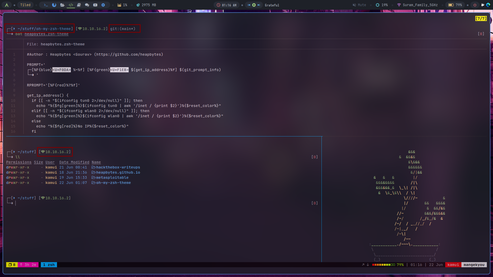

# Zsh promt theme

- The prompt takes tun0 ip address if you are connected to a VPN, else wlan0 ip address is printed.

> This is an update version of my previous edited zsh theme.
 
> You can call this an fork on rkj theme.

## Showcase

